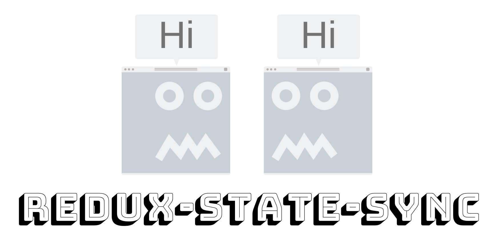
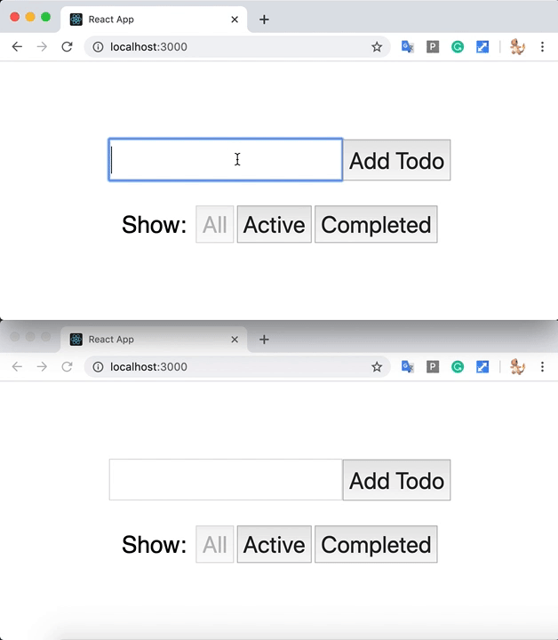

<p align="center">
  <a href="https://github.com//jasondhoman/redux-state-sync">
    
  </a>
</p>

## Redux-State-Sync 3

A lightweight middleware to sync your Redux state across browser tabs with **full TypeScript support and generic types**. It listens to the Broadcast Channel API and dispatches exactly the same actions dispatched in other tabs to keep the Redux state in sync.

> **📦 This is a modern refactor of [AOHUA/redux-state-sync](https://github.com/AOHUA/redux-state-sync)** — bringing the package up to date with full TypeScript generics, modern tooling, and comprehensive test coverage for production use.

[](https://www.npmjs.com/package/@mestuka/redux-state-sync)

### Why Redux-State-Sync?



It syncs your Redux store across tabs with **minimal configuration** and **complete type safety**.

Thanks to [BroadcastChannel](https://developer.mozilla.org/en-US/docs/Web/API/Broadcast_Channel_API), we have an efficient way to communicate between tabs instead of relying on local storage. [pubkey's BroadcastChannel](https://github.com/pubkey/broadcast-channel) provides a polyfill ensuring compatibility across all browsers.

### Installation

#### npm

```bash
npm install --save @mestuka/redux-state-sync
```

#### yarn

```bash
yarn add @mestuka/redux-state-sync
```

#### pnpm

```bash
pnpm add @mestuka/redux-state-sync
```

### TypeScript Support

Full TypeScript support with **generics for state and action types** is built-in. No additional type packages needed!

### Before You Use

**Important considerations:**

1. **Serialization**: BroadcastChannel only supports the [structured clone algorithm](https://developer.mozilla.org/en-US/docs/Web/API/Web_Workers_API/Structured_clone_algorithm) (Strings, Objects, Arrays, Blobs, ArrayBuffer, Map). Ensure actions don't contain functions in payloads.

2. **redux-persist**: If using redux-persist, blacklist persistence actions: `persist/PERSIST`, `persist/REHYDRATE`, etc.

3. **Action Filtering**: Use `predicate`, `blacklist`, or `whitelist` to control which actions sync across tabs.

### Quick Start

#### Modern Setup with Redux Toolkit

```typescript
import type { SyncStateConfig } from '@mestuka/redux-state-sync';

import { createStateSyncMiddleware, initMessageListener, initStateWithPrevTab } from '@mestuka/redux-state-sync';
import { configureStore } from '@reduxjs/toolkit';

import counterReducer from './features/counterSlice';

// 1. Define your state type for full type safety
export type RootState = {
  counter: {
    value: number;
  };
};

// 2. Configure sync with generic state type
const stateSyncConfig: SyncStateConfig<RootState> = {
  channel: 'my-app-channel',
  blacklist: [], // All actions sync by default
  prepareState: (state: RootState) => state, // ✓ Type-safe
  receiveState: (prev: RootState, next: RootState) => next, // ✓ Type-safe
};

// 3. Create store with middleware
export const store = configureStore({
  reducer: {
    counter: counterReducer,
  },
  middleware: getDefaultMiddleware =>
    getDefaultMiddleware().concat(
      // ✓ Generic type ensures type safety
      createStateSyncMiddleware<RootState>(stateSyncConfig),
    ),
});

// 4. Initialize message listener for multi-tab sync
initMessageListener(store);

// 5. Request initial state from other open tabs
initStateWithPrevTab(store);

// Export types for use in components
export type AppDispatch = typeof store.dispatch;
export type AppStore = typeof store;
```

#### Classic Redux Setup

```typescript
import type { SyncStateConfig } from '@mestuka/redux-state-sync';

import { createStateSyncMiddleware, initMessageListener, initStateWithPrevTab } from '@mestuka/redux-state-sync';
import { applyMiddleware, combineReducers, createStore } from 'redux';

// 1. Define your state type
type AppState = {
  todos: Todo[];
  filter: string;
};

// 2. Configure with generic state type
const config: SyncStateConfig<AppState> = {
  channel: 'my-app',
  blacklist: ['@@INIT', '@@REPLACE'],
};

// 3. Create middleware
const middlewares = [createStateSyncMiddleware<AppState>(config)];

// 4. Create store
const store = createStore(rootReducer, applyMiddleware(...middlewares));

// 5. Initialize listener
initMessageListener(store);

// 6. Request initial state from other tabs
initStateWithPrevTab(store);
```

### API Reference

#### `createStateSyncMiddleware<S, A>(config?)`

Creates Redux middleware for state synchronization across tabs.

**Generic Parameters:**

- `S` - Your Redux state type (e.g., `RootState`)
- `A` - Your action type (defaults to `UnknownAction`)

**Returns:** Redux Middleware

```typescript
const middleware = createStateSyncMiddleware<RootState>(config);
```

#### `initMessageListener(store)`

Initializes the message listener to **receive** state changes and actions from other tabs. Must be called once after store creation.

```typescript
initMessageListener(store);
```

#### `initStateWithPrevTab(store)`

Requests the **initial state** from other open tabs. Call this **after** `initMessageListener` to sync state from an existing tab.

```typescript
initMessageListener(store);
initStateWithPrevTab(store);
```

**Important:** Call both functions in order for proper multi-tab state synchronization:

1. `initMessageListener` - Sets up the listener to receive actions
2. `initStateWithPrevTab` - Requests initial state from other tabs

#### `createReduxStateSync<S, A>(reducer, receiveState?)`

Wraps your root reducer to handle initial state sync from other tabs (advanced usage).

```typescript
const wrappedReducer = createReduxStateSync<RootState>(
  rootReducer,
  (prev, next) => next,
);
```

#### `withReduxStateSync<S, A>`

Alias for `createReduxStateSync` (same functionality).

---

### Configuration Options

#### `channel`

**Type:** `string`  
**Default:** `"redux-state-sync"`  
**Required:** ✓ (recommended to set custom value)

Unique identifier for the BroadcastChannel. Apps with different channels won't sync with each other.

```typescript
const config: SyncStateConfig<RootState> = {
  channel: 'my-unique-channel-name',
};
```

#### `predicate`

**Type:** `(action: A) => boolean | null`  
**Default:** `null`

Custom function to filter which actions should sync across tabs.

```typescript
const config: SyncStateConfig<RootState> = {
  predicate: action => action.type !== 'INTERNAL_ACTION',
};
```

#### `blacklist`

**Type:** `string[]`  
**Default:** `[]`

Action types that should NOT sync to other tabs.

```typescript
const config: SyncStateConfig<RootState> = {
  blacklist: ['TEMP_ACTION', 'CACHE_UPDATE'],
};
```

#### `whitelist`

**Type:** `string[]`  
**Default:** `[]`

Only these action types will sync to other tabs. When set, `blacklist` is ignored.

```typescript
const config: SyncStateConfig<RootState> = {
  whitelist: ['USER_LOGIN', 'USER_LOGOUT'],
};
```

**Priority:** `predicate` > `blacklist` > `whitelist`

#### `broadcastChannelOptions`

**Type:** `BroadcastChannelOptions`  
**Default:** `undefined`

Options passed to the underlying BroadcastChannel. Useful for polyfill configuration.

```typescript
const config: SyncStateConfig<RootState> = {
  broadcastChannelOptions: {
    type: 'localstorage', // Force a specific backend
  },
};
```

#### `prepareState`

**Type:** `(state: S) => S`  
**Default:** `(state) => state`

Transform state before sending to other tabs. Must return the same state type.

```typescript
const config: SyncStateConfig<RootState> = {
  prepareState: (state: RootState) => {
    // Remove sensitive data, compact state, etc.
    return {
      ...state,
      secrets: undefined, // Don't send secrets to other tabs
    };
  },
};
```

#### `receiveState`

**Type:** `(prevState: S, nextState: S) => S`  
**Default:** `(prev, next) => next`

Merge or transform received state from other tabs. Must return the state type.

```typescript
const config: SyncStateConfig<RootState> = {
  receiveState: (prev: RootState, next: RootState) => {
    // Custom merge logic
    return {
      ...prev,
      ...next,
      counter: Math.max(prev.counter.value, next.counter.value),
    };
  },
};
```

---

### Type Safety Features

#### Generic State Type

```typescript
// ✓ Type-safe: TypeScript knows about state.counter.value
const config: SyncStateConfig<RootState> = {
  prepareState: state => state, // state: RootState
};
```

#### Generic Action Type (Advanced)

```typescript
import type { CounterAction } from './counterSlice';

// ✓ Type-safe for both state and actions
const config: SyncStateConfig<RootState, CounterAction> = {
  predicate: action => action.type !== 'counter/internal',
};
```

#### Type-Safe Dispatch

```typescript
// ✓ IDE autocomplete for dispatched actions
store.dispatch({ type: 'counter/increment' });

// ✓ Type-safe state access
const state = store.getState(); // state: RootState
console.warn(state.counter.value); // value: number
```

---

### Examples

#### Sync Specific Actions Only

```typescript
const config: SyncStateConfig<RootState> = {
  channel: 'my-app',
  whitelist: ['USER_LOGIN', 'USER_LOGOUT', 'CART_UPDATE'],
};
```

#### Exclude Internal Actions

```typescript
const config: SyncStateConfig<RootState> = {
  channel: 'my-app',
  blacklist: ['@@INIT', '@@REPLACE', 'SET_LOADING'],
};
```

#### Custom Predicate Logic

```typescript
const config: SyncStateConfig<RootState> = {
  channel: 'my-app',
  predicate: (action) => {
    // Don't sync temp or internal actions
    return !action.type.startsWith('__') && action.type !== 'TEMP';
  },
};
```

#### Transform State Before Syncing

```typescript
const config: SyncStateConfig<RootState> = {
  channel: 'my-app',
  prepareState: (state: RootState) => ({
    ...state,
    cache: undefined, // Don't send cache
    temporary: undefined, // Don't send temporary data
  }),
  receiveState: (prev, next) => {
    // Merge without losing local cache
    return {
      ...next,
      cache: prev.cache, // Keep local cache
    };
  },
};
```

#### Redux Persist Integration

```typescript
import { persistReducer, persistStore } from 'redux-persist';
import storage from 'redux-persist/lib/storage';

const config: SyncStateConfig<RootState> = {
  channel: 'my-app',
  // Blacklist persist actions to avoid conflicts
  blacklist: [
    'persist/PERSIST',
    'persist/REHYDRATE',
    'persist/PAUSE',
    'persist/PURGE',
  ],
};
```

---

### Browser Support

| Browser | Support     | Notes                      |
| ------- | ----------- | -------------------------- |
| Chrome  | ✅ Native   | Native BroadcastChannel    |
| Firefox | ✅ Native   | Native BroadcastChannel    |
| Safari  | ✅ Polyfill | Uses IndexedDB fallback    |
| Edge    | ✅ Native   | Native BroadcastChannel    |
| IE 11   | ✅ Polyfill | Uses localStorage fallback |

The [pubkey/broadcast-channel](https://github.com/pubkey/broadcast-channel) polyfill automatically falls back to available APIs.

---

### Performance Notes

- **Minimal Overhead**: Only syncs actions that pass your filters
- **Efficient**: Uses native BroadcastChannel API when available
- **Memory**: Stores window ID and action history (minimal footprint)
- **Throttling**: No automatic throttling; implement if needed for high-frequency actions

---

### Troubleshooting

#### State Not Syncing Between Tabs

1. **Ensure `initMessageListener` is called:**

   ```typescript
   initMessageListener(store); // Must be called after store creation
   ```

2. **Check the channel name:**

   ```typescript
   // Both tabs must use the same channel
   const channel = 'my-app';
   ```

3. **Verify action serialization:**
   - Ensure payloads don't contain functions
   - Check browser console for errors

#### Actions Not Syncing

1. **Check blacklist/whitelist:**

   ```typescript
   // Verify your action type isn't blacklisted
   blacklist: ['ACTION_TO_EXCLUDE'];
   ```

2. **Check predicate:**

   ```typescript
   // Verify predicate returns true for actions you want to sync
   predicate: action => action.type !== 'SKIP_ME';
   ```

3. **Monitor state changes:**
   ```typescript
   receiveState: (prev, next) => {
     console.warn('Received state:', next);
     return next;
   };
   ```

---

### Contributing

Contributions welcome! Please ensure:

- TypeScript builds without errors
- All tests pass
- Linting passes (ESLint)

```bash
npm run build    # Build
npm run typecheck  # TypeScript check
npm run test     # Run tests
npm run lint     # Check linting
npm run lint:fix # Fix linting issues
```

---

### License

MIT
